# Introduction

One of the fundamental roles of a statistician is to create methods to analyze data. This typically involves four components: developing the theory, translating the equations to computer code, a simulation study and a real data analysis. While these are enough to get published, it is unlikely your method will be used by others without a key fifth component: a software package. A package is a collection of reusable functions, the documentation that describes how to use them, tests and sample data. They provide a structured way to organize, use and distribute code to others and/or your future self. The objective of this workshop is to learn how to develop an `R` package. In addition to creating an `R` package from scratch, you will learn how to make it robust across platforms and future changes using continuous integration and unit testing. This workshop assumes familiarity with `R`, `RStudio`, writing functions, installing packages, loading libraries and requires a `GitHub` account. This will be an interactive workshop. 


<br><br>

# Pre-workshop set-up {#req}

You must bring your own laptop. **It is vital that you attempt to set up your system in advance. You cannot show up at the workshop with no preparation and keep up!**

* [R (version ≥ 3.6.0)](http://cran.r-project.org/)  
* [RStudio (version ≥ 1.2.1335)](https://www.rstudio.com/products/rstudio/download/#download). This is a powerful graphical user interface (GUI) which makes the package creation process much easier.  
* [Git](https://git-scm.com/downloads). I strongly recommend reading these [setup instructions by Jenny Bryan for Mac/Windows/Linux](https://happygitwithr.com/install-git.html) and the [Troubleshooting section](https://happygitwithr.com/troubleshooting.html).  
* Please read [Chapter 1: Why Git? Why GitHub?](https://happygitwithr.com/big-picture.html) to understand the big picture and motivation for using Git and Github.  
* [Sign up for a GitHub account](https://github.com/). We will use GitHub to host the source files of our `R` package. I also recommend reading [Jenny Bryan's advice on carefully choosing a username](https://happygitwithr.com/github-acct.html).  
* [GitKraken](https://www.gitkraken.com/). This is a GUI for Git which makes it much easier to dive into version control without the command line. GitKraken is to Git what RStudio is to R. This is optional but highly recommended, particularly for new Git users. You are free to use the GUI of your choice or simply the command line. In this workshop I will be using GitKraken.  
* Complete [Section 3](#gitgithub) of this tutorial.  
* Run the following commands in `R`:

```R
install.packages("pacman")
# this command checks if you have the packages already installed, 
# then installs the missing packages, then loads the libraries
pacman::p_load(knitr, rmarkdown, devtools, roxygen2, usethis) 

# identify yourself to Git with the usethis package
# use the exact same username and email associated
# with your GitHub account
usethis::use_git_config(user.name = "gauss", user.email = "gauss@normal.org")
```


<br><br>


<!-- # Git and GitHub {.tabset .tabset-fade .tabset-pills} -->

# Git and GitHub {#gitgithub}

## Introduction

This section walks you through the process of creating a GitHub repository (abbreviated as repo), creating a local copy of the repo (i.e. on your laptop), making some changes locally and updating your changes on the remote (aka GitHub repo). It assumes that you have successfully completed the requirements outlined in [Section 2](#req). The following figure summarizes some key terminology that we will make use of in this section:


<div class="figure">

<p class="caption">source: http://ohi-science.org/data-science-training/</p>
</div>

<br>

## Annotations

For each step, I have provided screenshots annotated with red rectangles, circles and arrows. You can click on each image to enlarge it. The following table describes what each of the annotations represent. 


Annotation                                                                                     Description                          
---------------------------------------------------------------------------------------------  -------------------------------------
<a href="assets/img/box.png">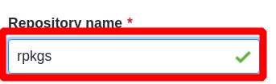</a>         Enter text or fill in the blank      
<a href="assets/img/circle.png">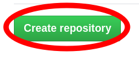</a>   Click on the circled button          
<a href="assets/img/arrow.png">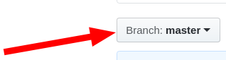</a>     Take note of. No action is required. 


<br>

## Step 1: Create a remote repo {#remote}

We first create a GitHub repo. Head over to https://github.com and login. Then click on new repository:

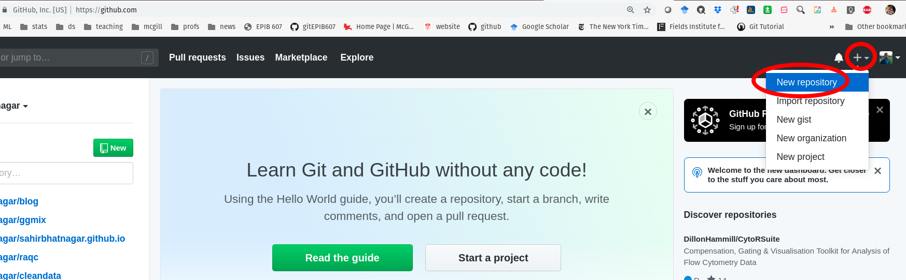


Give it a name. It can be anything you want (just pick a name that will remind you that this repository contains the source files of your `R` package). In the screenshots below I used `rpkg` throughout. Click on `Create repository`:

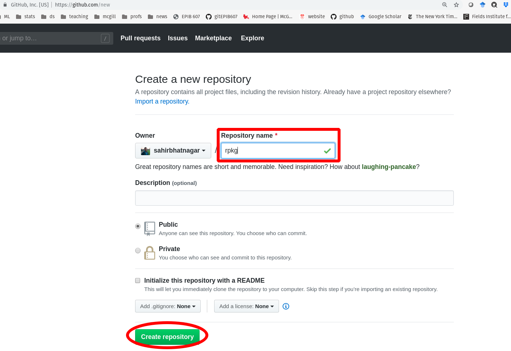

Copy the link of your newly created repo to your clipboard:

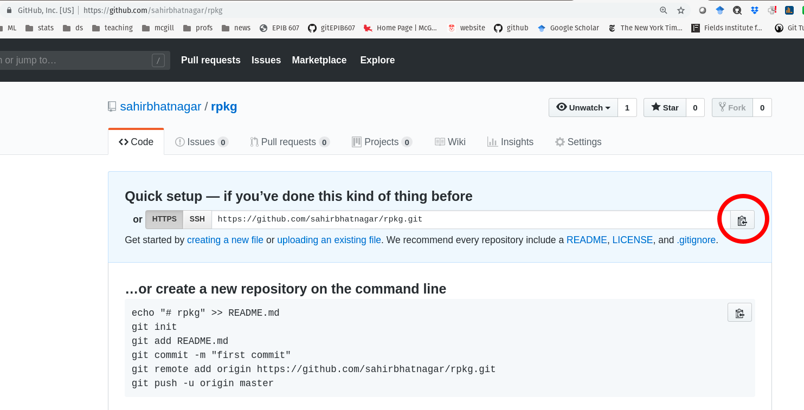


<br>

## Step 2: New `RStudio` Project via `git clone` {#clone}

Create a local copy of the remote repo using `RStudio` projects:

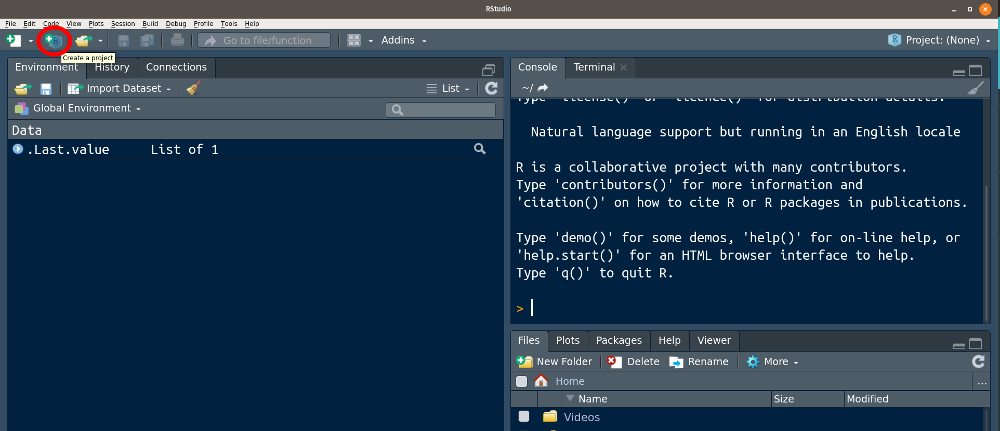

Click on `Version Control`:

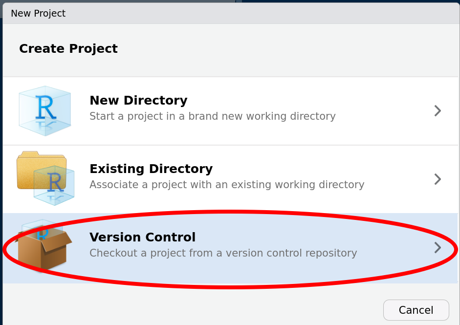

Click on `Git`. Note that if you get an error or you don't see this option, this likely means that your `RStudio` doesn't know where to find your local `Git` installation. Please see [Chapter 13: Detect Git from RStudio](https://happygitwithr.com/rstudio-see-git.html) for troubleshooting this.


Paste the link to your remote repo in the `Repository URL` box, name the folder that will contain your `R` package files, and browse to where you want the folder to be saved in your filesystem. Click on `Create Project`:

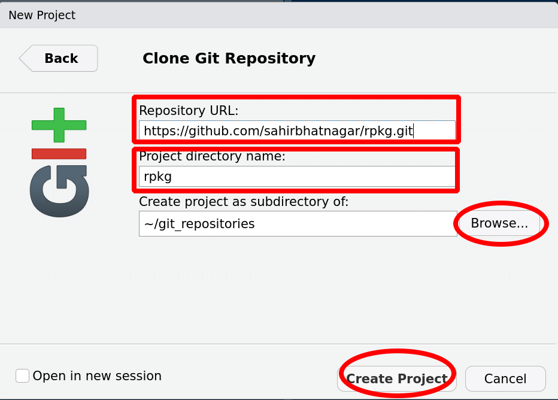


Your `RStudio` window should open a new project in the specfied directory. Take note of the following points annotated in the screenshot below:

1. The `Git` tab allows you to use `Git` and push to `GitHub` within `RStudio`. You will see any changes that have been made to your files since the last commit here. I have found the `RStudio` interface to `Git` to be inadequate and slow. I just want you to be aware of this functionality. I only look at this tab to quickly see if there were any changes, but do all my version controlling and interfacing with `GitHub` using `GitKraken`.
2. Shows the path of your working directory, which is set to the root of your `RStudio` project by default. You can always click on the arrow to return to the working directory. 
3. Indicates the name of your `Rstudio` project. It's also a dropdown menu for other recently opened `RStudio` projects. 
4. Filesystem viewer of your working directory. You should see a `.gitignore` file and the `RStudio` project file. These were automatically added by `RStudio` when you created a new project from a `GitHub` repo. 
5. A dropdown menu with extended `Git` functionalities. 


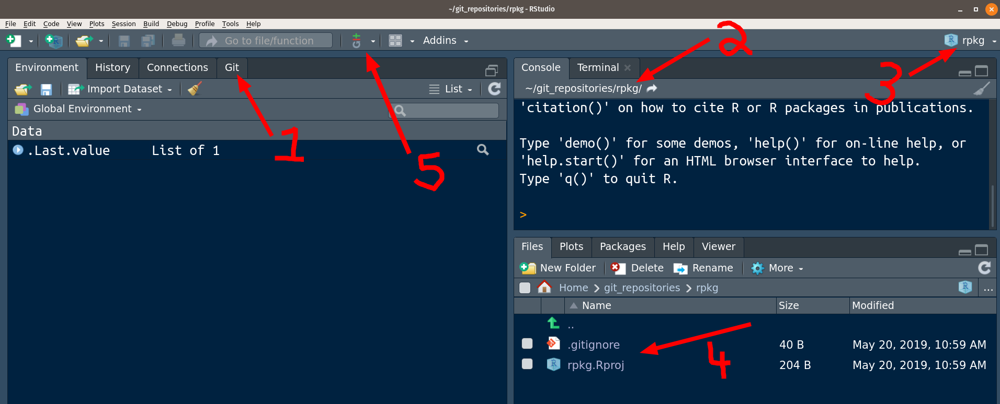


<br>

## Step 3: `add` and `commit` your changes {#add}

The following figure shows the commands needed for a basic version controlled workflow. Refer back to this figure once you complete [Step 3](#add) and then once again when you complete [Step 4](#push) (it should make a little more sense). 

<div class="figure">
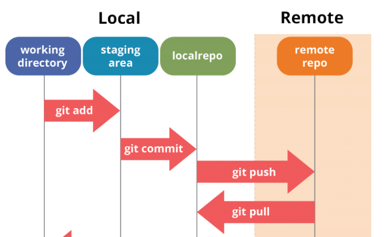
<p class="caption">source: https://www.edureka.co/blog/git-tutorial/</p>
</div>


Have you ever versioned a file by adding your initials or the date? That is effectively a `commit`, albeit only for a single file: it is a version that is significant to you and that you might want to inspect or revert to later [@happygit]. The `commit` command is used to save your changes to the local repository. From the `Git` tab, click on `Commit`:


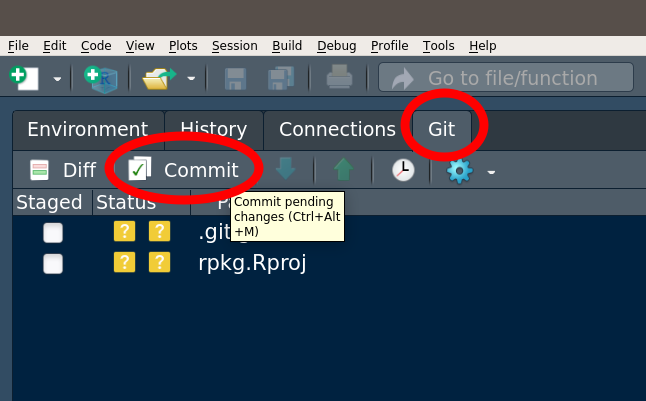

Note that you have to explicitly tell `Git` which changes you want to include in a `commit` before running the `git commit` command. This means that a file won't be automatically included in the next commit just because it was changed. Instead, you need to use the `git add` command to mark the desired changes for inclusion. Instead of typing `git add` in the terminal, you can simply click the boxes next to the files you want to add (this is also referred to as _staging_ a file). The lines 1 to 4 highlighted in green refer to the contents of the `.gitignore` file and the green highlight indicates they are being added to the file (red highlight indicates removal of a line):

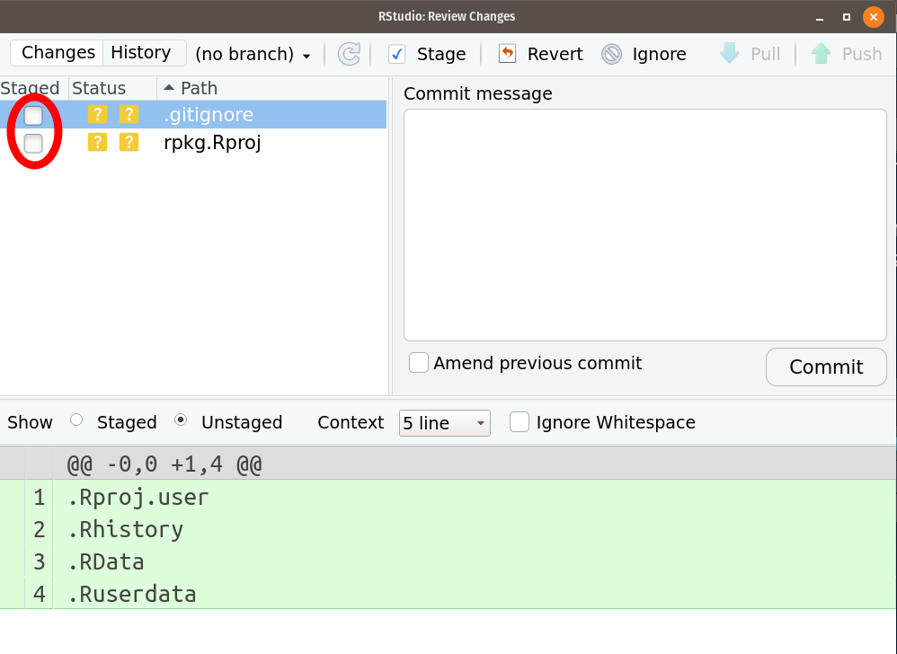

Every time you make a `commit` you must also write a short `commit` message. Ideally, this conveys the motivation for the change. Remember, the diff will show the content. When you revisit a project after a break or need to digest recent changes made by a colleague, looking at the history, by reading commit messages and skimming through diffs, is an extremely efficient way to get up to speed [@happygit]. Enter a `commit` message and click on the `Commit` button:


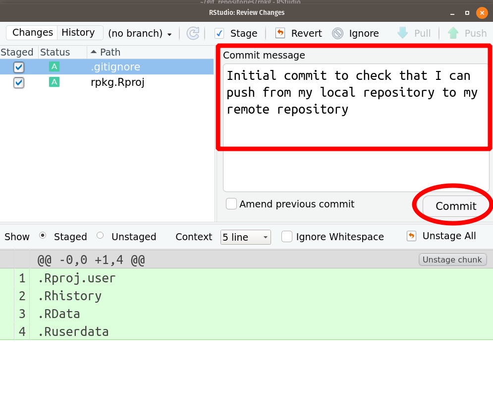


If everything worked, you should see the following screen with the `commit` message and the files that were added:

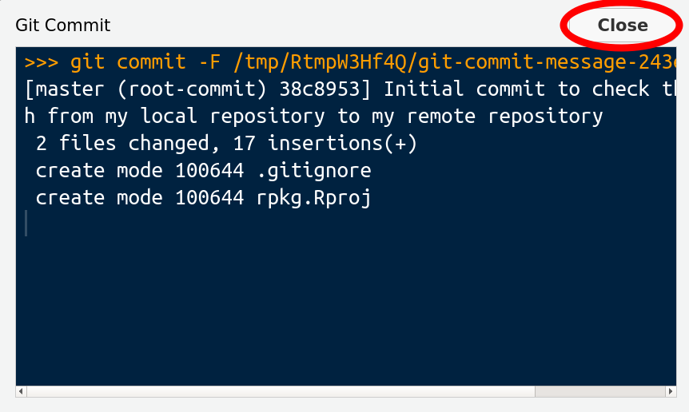


<br>

## Step 4: `push` your local commits {#push}

The `push` command is used to publish new local commits on a `remote` server (the remote repo you created in [Step 1](#remote)):

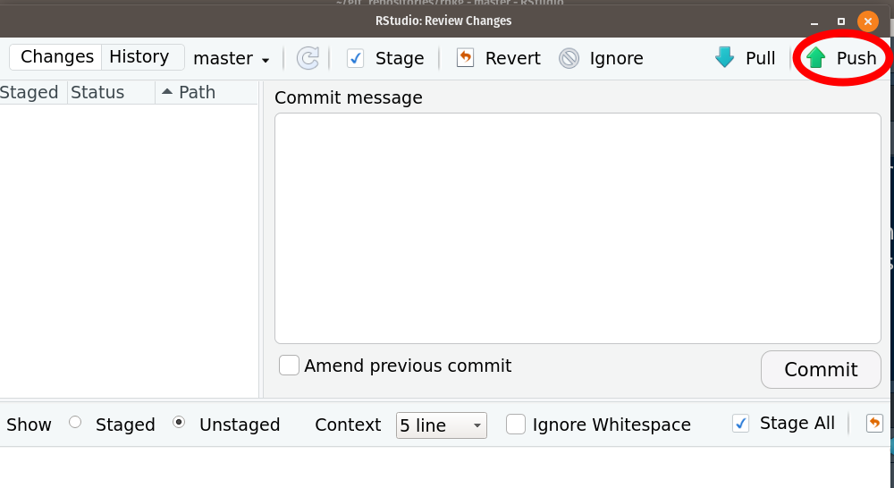

Enter your username:


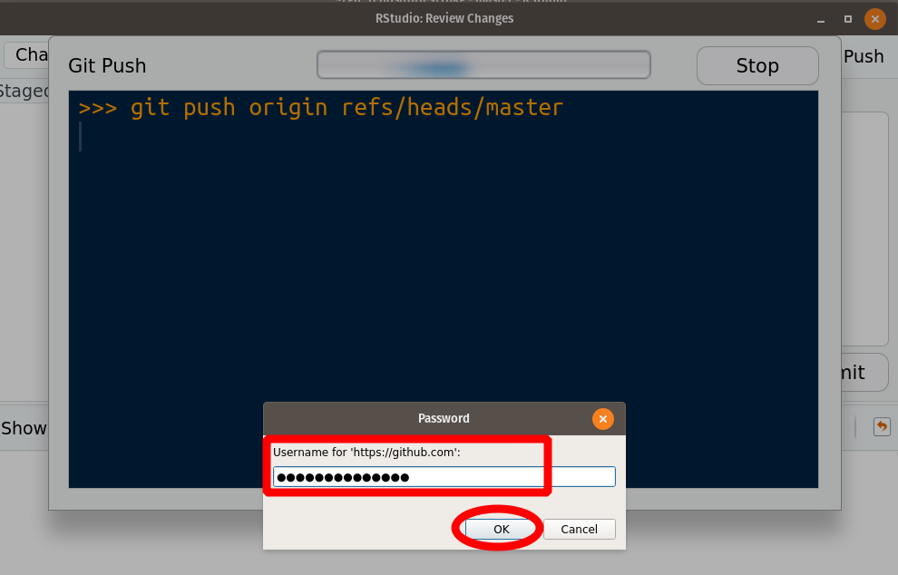


and your password:

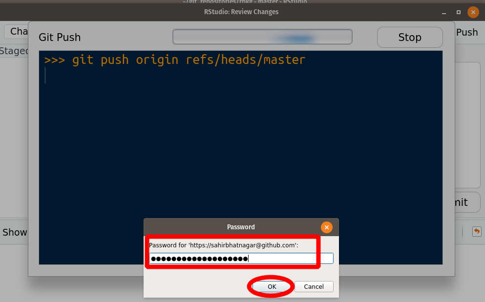

Note the following:

1. The URL of the remote repo.
2. The name of the local branch called `master`. (We'll talk about branches later).
3. The name of the remote branch also called `master`. `master -> master` indicates that you have pushed the commit from the local `master` branch to the remote `master` branch.
4. The command you can enter in the terminal instead of using the `RStudio` interface to `push` your commit to the `remote`.


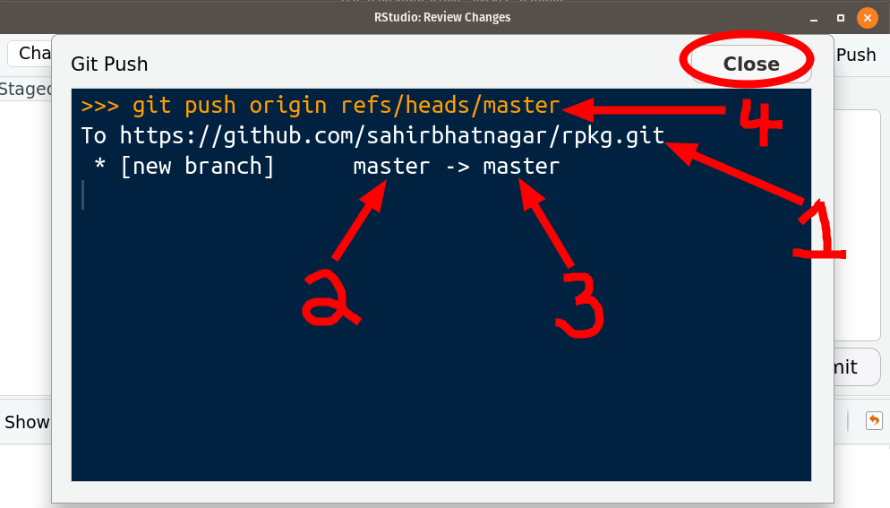

Head over to your remote `GitHub` repo and take note of the following:

1. The newly added files.
2. The `commit` message.
3. You are currently viewing the contents of the `master` branch.
4. The unique ID of the `commit`. A Git commit ID is a [SHA-1 hash](https://en.wikipedia.org/wiki/Cryptographic_hash_function) of every important thing about the commit. Clicking on it will allow you to see the difference (aka `diff`) between the previous commit.
5. The number of commits (aka snapshots of the repo).
6. The number of branches. 

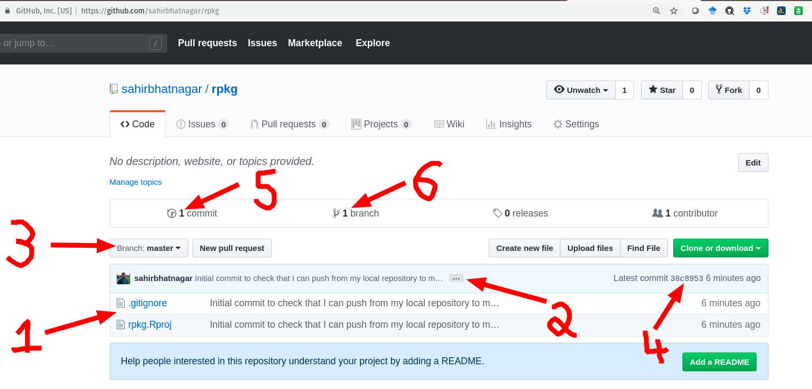


<br>

## Step 5: Open the repo with `GitKraken` {#kraken}

Link your `GitHub` account to `GitKraken`; you will be prompted for this when opening the `GitKraken` application for the first time. Open the local repo created in [Step 2](#clone):


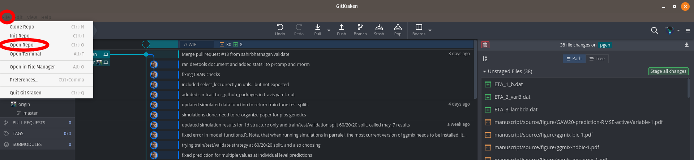


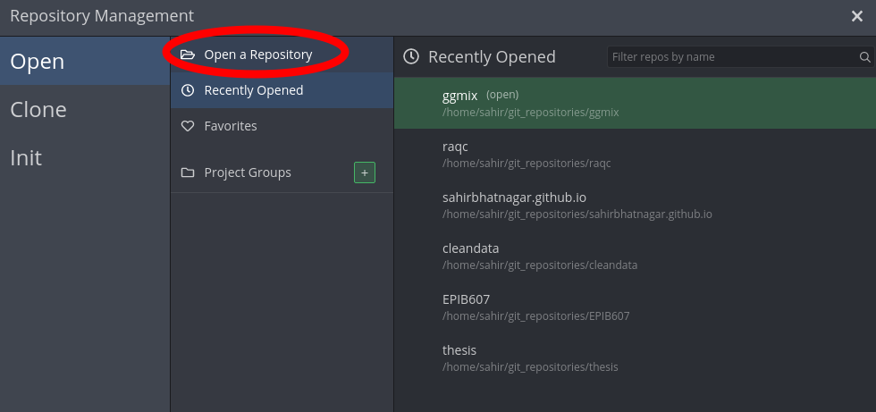


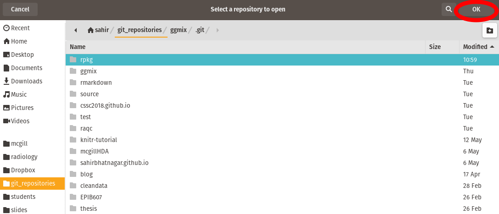

The following screenshot shows the local repo in the `GitKraken` GUI. Note the following (which has similar attributes to the online `GitHub` repo):

1. The newly added files.
2. The `commit` message.
3. You are currently viewing the contents of the `master` branch.
4. The unique ID of the `commit`. A Git commit ID is a [SHA-1 hash](https://en.wikipedia.org/wiki/Cryptographic_hash_function) of every important thing about the commit. Clicking on it will allow you to see the difference (aka `diff`) between the previous commit.
5. The branches available locally.
6. The branches available on the remote.

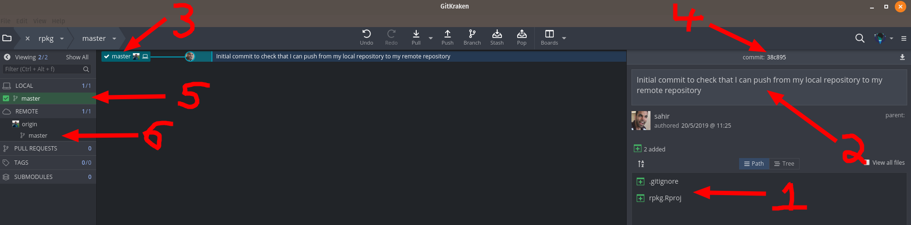


<br><br>

## Discussion

Hopefully you were able to successfully complete all the steps in this Section. The main takeaway is to be able to `add`, `commit`, and `push` your local commits to the remote repo. It's completely normal if you still have very little understanding of what just happened. I will clarify during the workshop. The point was for you to take a first stab at using version control and come to the workshop as prepared as possible. 


<br><br>

# References


